# Smart-Appliance-Project

## Quick-Start Guide:
1)	First configure the various AWS services and roles (Refer to Section 3 - Software setup instructions) 
2)	Update the credentials file on both the input and output RPi as well as the EC2 webserver
3)	Run weather.py and smart_appliance.py on the input RPI
4)	Run output.py on output RPI
5)	Run populate_s3.py to populate baseline images to the S3 bucket (Note: Baseline images should be in the same folder as well)
6)	Run the ‘sudo -s’ command on the EC2 server before running the server.py file

## Hardware checklist:
-	1 DHT11 sensor
-	1 LED
-	1 LCD screen
-	1 SW-420 Vibration Sensor
-	1 BMP 180 Pressure Sensor
-	1 Buzzer
-	3 Buttons
-	1 Picamera

## Hardware setup instructions:
1)	The SW-420 vibration sensor has 3 pins namely the digital output, GND and VCC pin. The data pin can be used to connect with any GPIO pin and the voltage suitable for the sensor is 3.3V to 5V however it is recommended to use 3.3V. 
2)	The BMP-180 pressure sensor has 4 pins namely the SDA, SCL, GND and VCC pins. Connect the jumper wires accordingly and connect it to the SDA, SCL and GND pins on the breadboard. As for the VCC pin it is also recommended to use 3.3V.

## Fritzing Diagram:


## Software Checklist:
### EC2 Server Configuration 

```bash
sudo yum check-update
sudo yum install -y amazon-linux-extras
sudo amazon-linus-extras enable python3.8
sudo yum clean metadata
sudo yum install python38 -y
```

### EC2 Server and RPIs
```bash
pip install gpiozero
pip install telepot
pip install picamera
Pip install flask
Pip install numpy
Pip install boto3
Pip install AWSIoTPPythonSDK
Pip install paho-mqtt
```

## Software setup instructions:
### A) Register “Smart_Appliance_RPI_Input” Raspberry Pi as a Thing in AWS
  1. Search for IoT-core service and select it
     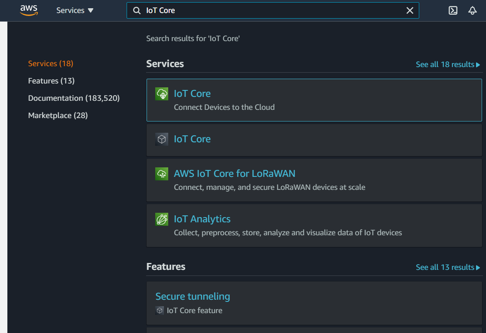__
  2. In the left navigation pane, click “Manage” to expand it, choose “Things”. Next, click “Create”.
     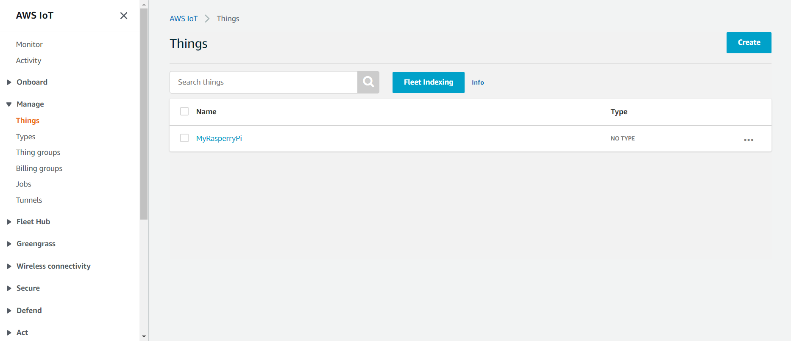
  3. Select “Create a single thing”.
     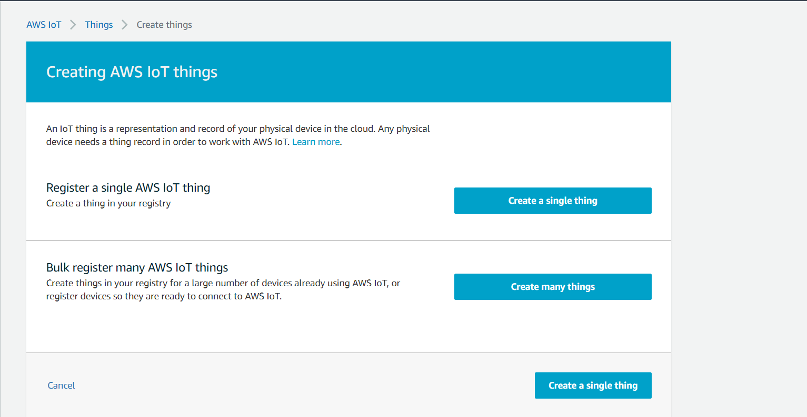
  4. Enter the name “Smart_Appliance_RPI_Input”. Click Next.
     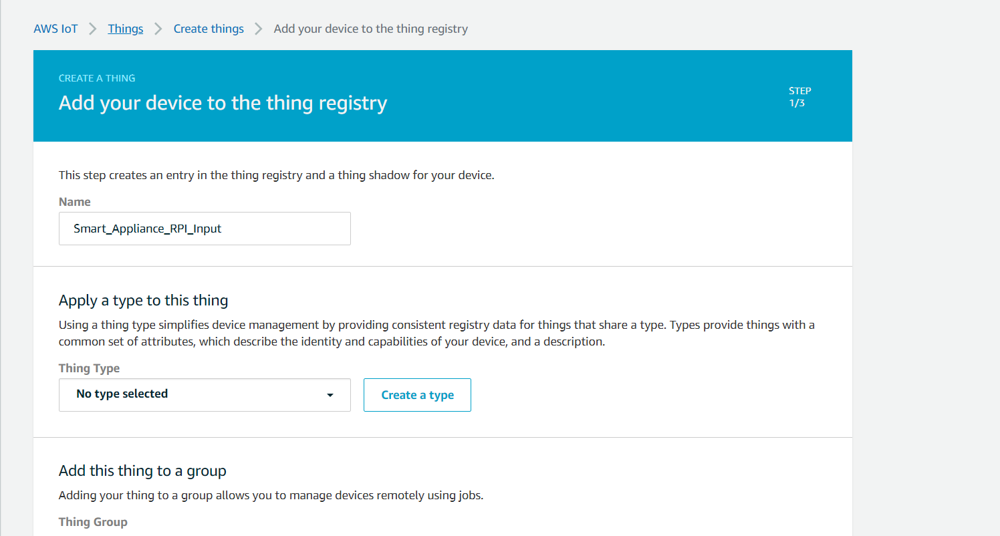
  5. Select “Create certificate”.
     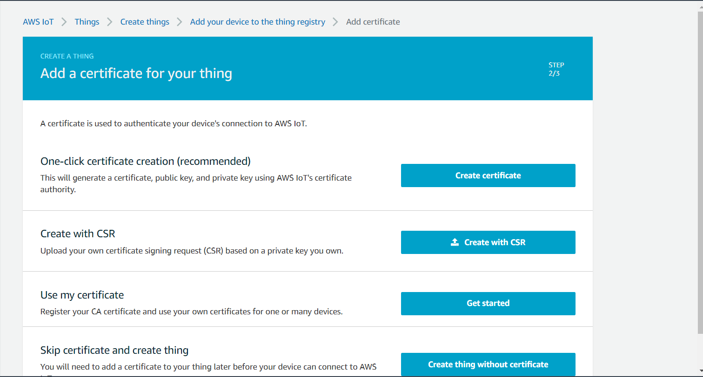
  6. Download the following three files:
    • A certificate for this thing
    • A public key
    • A private key
     Then, click “Download” for the root CA.
     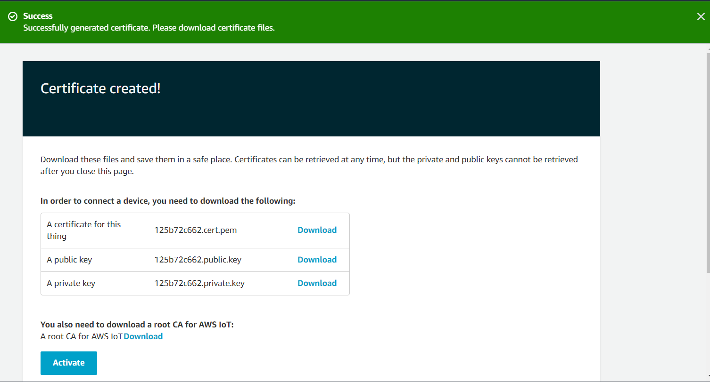
  7. You will be presented with the following page. Right-click “Amazon Root CA 1” and select “Save link as” to download this root certificate.
     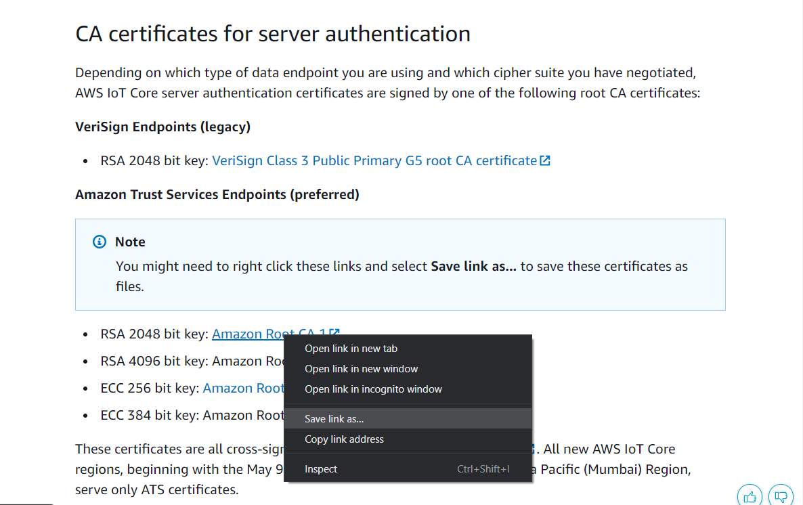
  8. Then, click the “Activate” button. You should see “Successfully activated certificate” and the Activate button changes to “Deactivate”.
     
  9. Click to the next page and select “Register thing”. Upon successfully registering “Smart_Appliance_RPI_Input”, you should see it appear in the table as follows.
     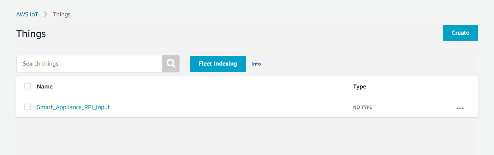
  11. Next, we have to attach the security policy to the certificate created for the “Things”. On the left “IoT Core” dashboard, under “Secure” sub-menu, click “Certificates”.
     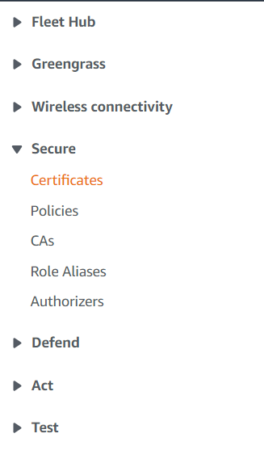
  12. The X.509 certificate created earlier is shown as follows. Click the triple dot in the certificate and select “Attach policy”.
     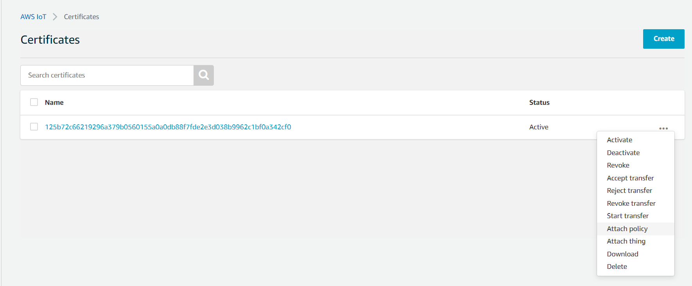
  13. Check the “Smart_Appliance_Policy” and click the “Attach” button.
     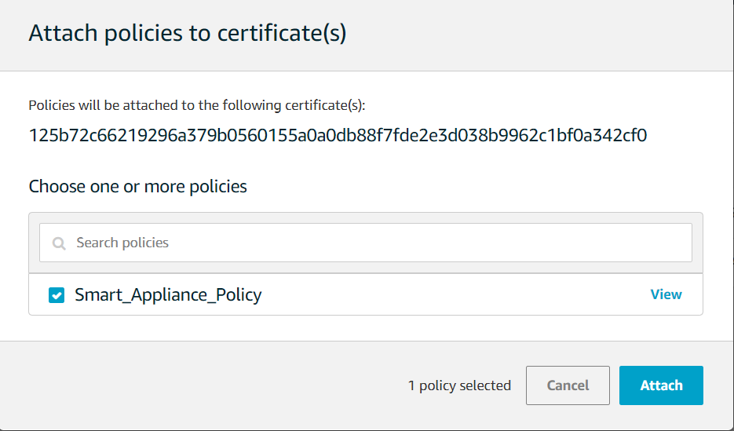
  14. Next, we have to attach the “Thing” to the certificate. In the certificates page, select the triple dot beside the certificate and click “Attach thing”.
     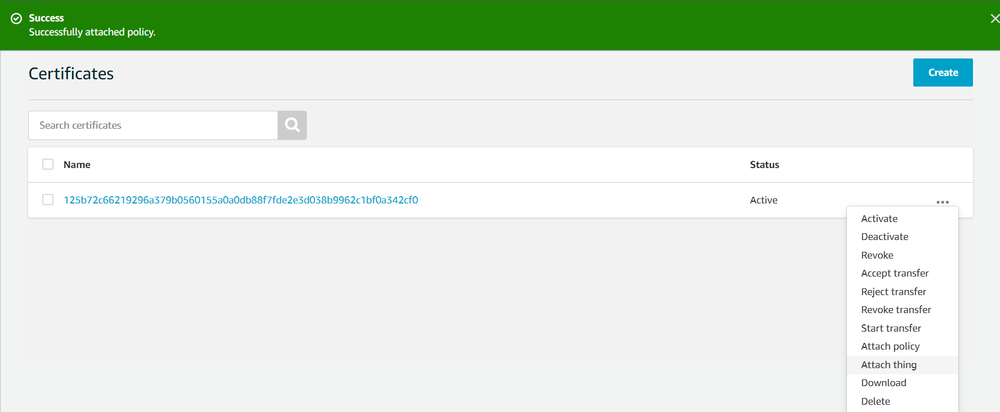
  15. In the “Attach things to certificate(s)” dialog box, select the check box next to the thing that was created “Smart_Appliance_RPI_Input”, and click “Attach”.
     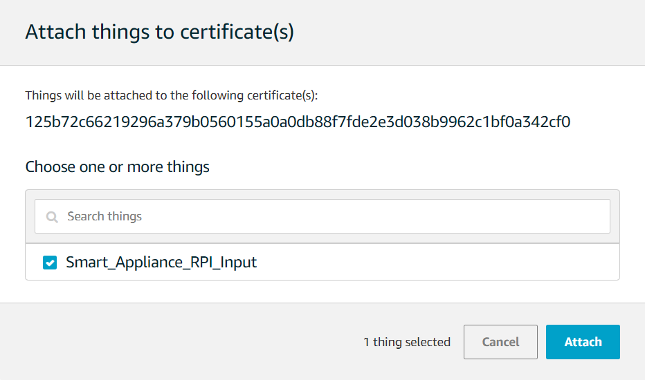
  16. On the left “IoT Core” dashboard under “Manage” sub-menu, click “Things”.
     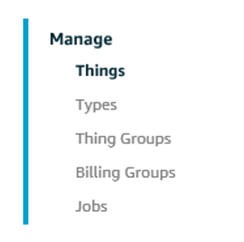
  17. On the next screen, select “Interact”. Copy and paste the REST API endpoint of “Smart_Appliance_RPI_Input” into a Notepad as you will need this value later.
     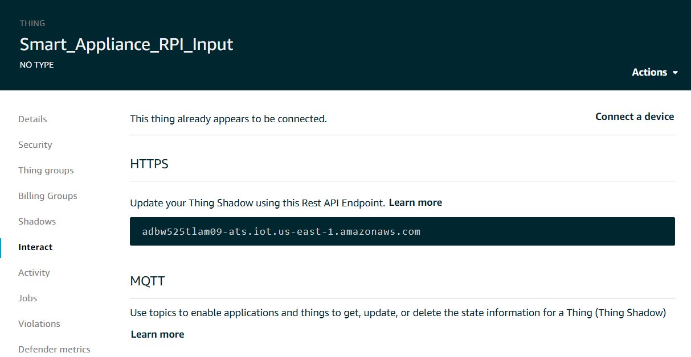

### B) Register “Smart_Appliance_RPI_Output” Raspberry Pi as a Thing in AWS
The following steps are similar to Section A but with certain tweaks.
  1. Search for IoT-core service and select it.
  2. In the left navigation pane, click “Manage” to expand it, choose “Things”. Next, click “Create”.
  3. Select “Create a single thing”.
  4. Enter the name “Smart_Appliance_RPI_Output”. Click Next.
     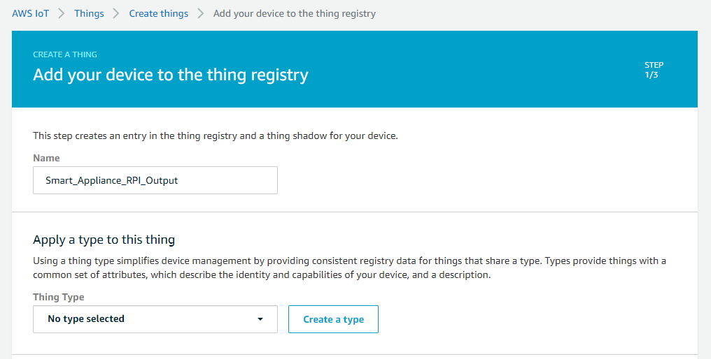
  5. Select “Create certificate”
  6. Download the following three files:
      a. A certificate for this thing
      b. A public key
      c. A private key
      Then, click “Download” for the root CA.
  7. You will be presented with the following page. Right-click “Amazon Root CA 1” and select “Save link as” to download this root certificate.
  8. Then, click the “Activate” button. You should see “Successfully activated certificate” and the Activate button changes to “Deactivate”.
  9. Click to the next page and select “Register thing”. Upon successfully registering “Smart_Appliance_RPI_Output”, you should see it appear in the table as follows.
     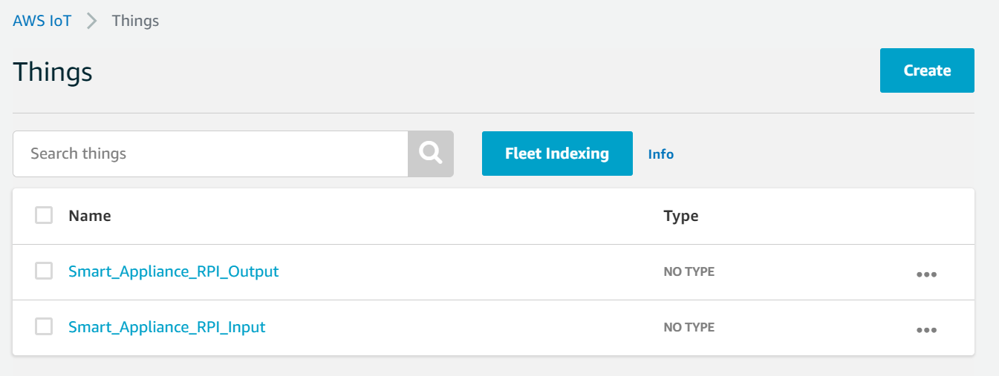
  10. On the left “IoT Core” dashboard, under the “Secure” sub-menu, select “Policies”.
  11. Select “Create a policy”.
     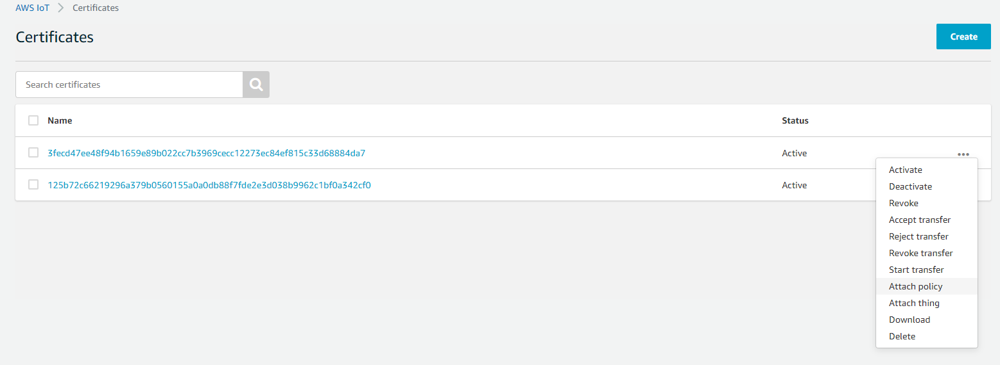
  12. Create a new Security Policy for our RPIs with the following configurations:
     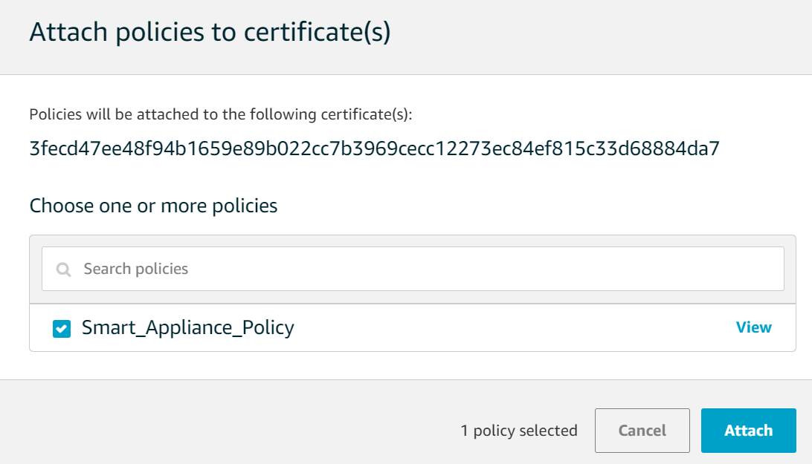
  13. Click “Create”. The policy would be successfully created.
     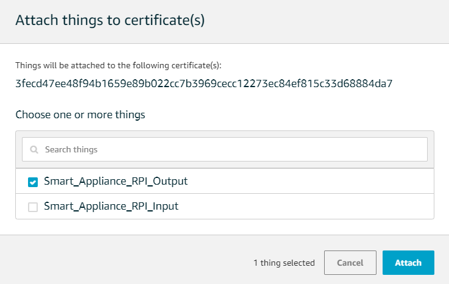
  14. Next, we have to attach the security policy to the certificate created for the “Things”. On the left “IoT Core” dashboard, under “Secure” sub-menu, click “Certificates”.
     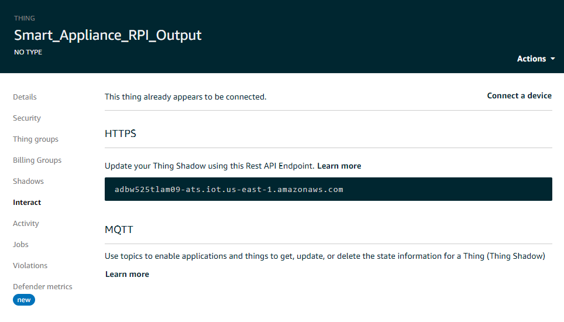
  15. The X.509 certificate created earlier is shown as follows. Note that you should select the certificate created for “Smart_Appliance_RPI_Output”. Click the triple dot in the certificate and select “Attach policy”.
  16. Check the “Smart_Appliance_Policy” and click the “Attach” button.
  17. Next, we have to attach the Output RPI “Thing” to the certificate. In the certificates page, select the triple dot beside the Output RPI certificate and click "Attach Thing"
  18.  In the “Attach things to certificate(s)” dialog box, select the check box next to the thing that as created “Smart_Appliance_RPI_Output”, and click “Attach”.
  19.  Next, on the left “IoT Core” dashboard under “Manage” sub-menu, click “Things”.
  20.  On the next screen, select “Interact”. Copy and paste the REST API endpoint of
“Smart_Appliance_RPI_Output” into a Notepad as you will need this value later.


